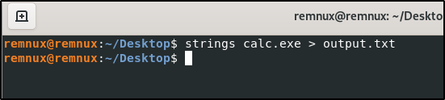

# Task 2

# 2. Malware Analysis Basics

## Static Analysis

- Take calc.exe from windows and paste it into REMnux VM.
- Now run the command `strings calc.exe > output.txt` .
    
    
    
- Output.txt file.
    
    
    

### Interesting strings found inside calc.exe

Static analysis of calc.exe revealed notable strings. The presence of “**CalculatorStarted**” indicates initialization logging of the program. The string “**MicrosoftCalculator**” confirms the executable’s identity as a trusted Windows utility. Additionally, the API call “**ShellExecuteW**” shows capability to invoke other processes, aligning with standard GUI application behavior and confirming benign functionality

## Hybrid Analysis

- No suspicious registry modifications.
- No outbound network connections.
- Only standard Windows DLLs (e.g., `user32.dll`, `gdi32.dll`) loaded.

### Comparison with REMnux

- Both analyses confirm reliance on core Windows DLLs and GUI resources.
- Process creation and user interaction confirmed; no malicious persistence, network communication, or file system modifications detected.
- Both REMnux and Hybrid Analysis validate *calc.exe* as a benign Windows system utility.