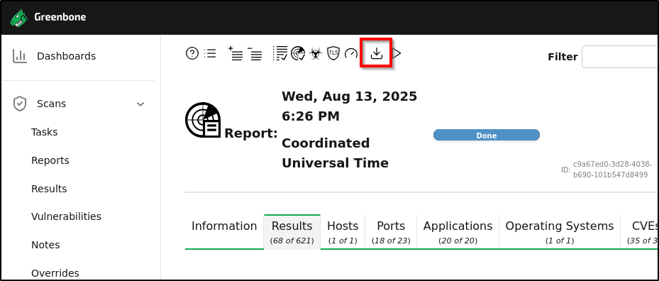

# Task 3

# 3. Build a Vulnerability Management Pipeline

## 1. Vulnerability Scan with OpenVAS

- Deploy **Metasploitable2** in your lab and install **OpenVAS (Greenbone Vulnerability Manager)**.
- Run a full vulnerability scan against the Metasploitable2 VM.
- Export the results in **XML** format.




## 2. Installing DefectDojo

- Run the below commands and install the DefectDojo in your kali system.

```bash
git clone https://github.com/DefectDojo/django-DefectDojo
cd django-DefectDojo
# building
docker-compose build
# running
docker-compose up
# obtain admin credentials. the initializer can take up to 3 minutes to run
# use docker-compose logs -f initializer to track progress
docker-compose logs initializer | grep "Admin password:"
```

- Import the OpenVAS report in the DefectDojo.
- Open DefectDojo, goto to **Engagement** > **Findings** > **Import Scan result.**


- Now we can see all the vulnerability in defect dojo as well.


- 3 prioritized vulnerability
    
    
    | Vulnerability | CVSS Score | Description |
    | --- | --- | --- |
    | VSFTPD Backdoor | 7.5 | Malicious backdoor in vsftpd 2.3.4 allowing remote attackers to gain root access via a crafted smiley in the username field. |
    | Unpatched Samba RCE | 9.0 | Samba service vulnerable to remote code execution due to improper handling of RPC requests. |
    | Rlogin Passwordless | 6.5 | Rlogin service configured with passwordless trust, allowing remote login without authentication. |

## 3. Remediation

### (a) VSFTPD Backdoor

- **Mitigation**:
    - Immediately **disable the FTP service** if not required.
    - If FTP is needed, upgrade to a secure version or migrate to **SFTP/FTPS**.
    - Restrict access to the service with firewall rules or allow-listing.

### (b) Samba RCE

- **Mitigation**:
    - Update Samba to the latest patched version.
    - Restrict Samba services to trusted networks only.
    - Apply strict **ACLs** to shared directories.

### (c) Rlogin Passwordless Authentication

- **Mitigation**:
    - **Disable the Rlogin service** (`rlogin`, `rsh`, `rexec`) completely — it is insecure by design.
    - If legacy applications require it, enforce **ssh-based authentication** instead.