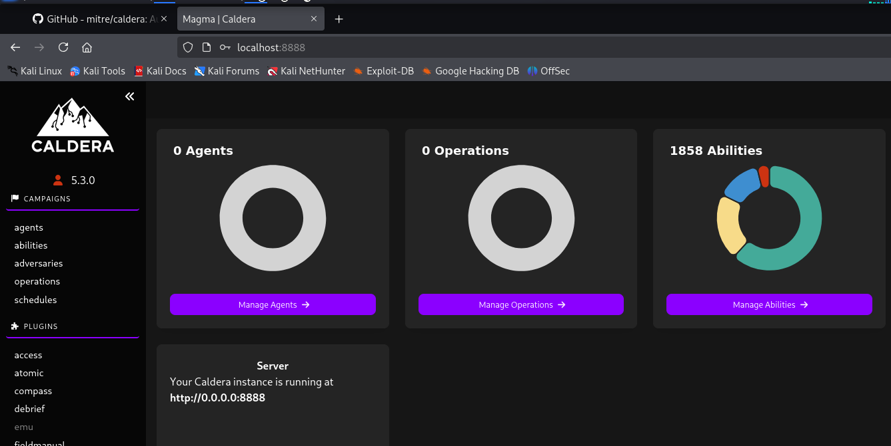

# Task 4

# 4. Incident Response Simulation

### Installing Caldera

```bash
## To clone the Caldera from github
git clone [https://github.com/mitre/caldera.git](https://github.com/mitre/caldera.git) --recursive
cd caldera

## To build the docker for caldera
docker build --build-arg VARIANT=full -t caldera .

## To start the Caldera server
docker run -it -p 8888:8888 caldera
```

- After installing, access the **Caldera** on `http://localhost:8888`
- Login using the given credentials, which appears when you run the docker.



```bash
Log into Caldera with the following admin credentials:                                                                                                                            Red:
	USERNAME: red
	PASSWORD: j1l-oDYEL-7mtjfGPmph97HY9YbFL_wlLd9xVJEUksQ
	API_TOKEN: NIEh-vXgFYYH5Ww16dEM8K8PVW8qEEcZAa637XQ7piU
	
Blue:
	USERNAME: blue
	PASSWORD: 8sgoRc5miDcdivFHwERqD3y2pZDckCsmMQFSPWxVHqM
	API_TOKEN: hZWQIAaWgcLogSaRdT3xBZJwWTxTrADSDP1gE6hkkhc 
```

- Add a agent by running the below command on the Windows VM.
    
    
    

- Goto Adversaries and create a **New Profile**  and then add the ability.
    - File Download via PowerShell.
    - Scheduled Task Startup Script.
    
    
    

- Now goto **Operations** > **Create new Operation > Select the Adversary which we have created (Phishing Test)**


- Once we start the operation it will simulate the Phishing mail attack on the Windows VM.


### Attack Path summary:

The attack began with a simulated phishing email containing a malicious link. The user on the Windows VM clicked the link, triggering a PowerShell script (`powershell.exe`). This script employed the `DownloadString` method to retrieve a second-stage payload from a Caldera-controlled 
server. The payload was executed in memory, evading traditional disk-based detection. The execution chain established persistence by creating a scheduled task. This task was configured to periodically call back to the command-and-control (C2) server, allowing the adversary to 
maintain access within the environment and execute further malicious directives from the Caldera server.

## Running Velociraptor

- Download the velociraptor from the link [`https://docs.velociraptor.app/downloads/`](https://docs.velociraptor.app/downloads/)
- Run the below command from powershell and velociraptor will open.
    
    ```bash
    .\velociraptor-v0.74.5-windows-amd64.exe gui
    ```
    
    
    

- Go to `Hunt Manager` > `New Hunt` > `Select Artifacts` > `windows.system.pslist` > `Launch`
    
    
    

- Then click on Run the Hunt.
    
    
    

- Goto `Collected Artifacts` > `Results` > `Export as csv`
    
    
    

Do the same thing for netstat

- Go to `Hunt Manager` > `New Hunt` > `Select Artifacts` > `windows.network.netstat` > `Launch`
- Then run the artifact.
- Goto `Collected Artifacts` > `Results` > `Export as csv`
    
    