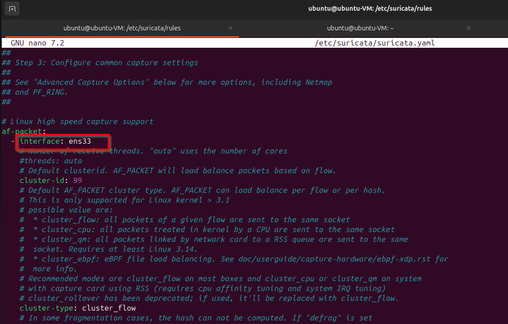

# Task 5

# 5. Network Defense with Open-Source Tools

## Installing Suricata

```bash
sudo apt install suricata -y
```

- Make sure your interface is same as your vm interface.
    
    
    

- Creating a file to block the malicious IP.

```bash
sudo nano /etc/suricata/rules/local.rules
```

```bash
drop ip 192.168.16.129 any -> any any (msg:"Block Malicious IP"; sid:1000001;)
```


Now lets try to ping from another VM.


Ping is not going from our Kali attack box. So suricata is working properly.

## ATT&CK mapping table (example)

| Alert | Tactic | Technique | Notes |
| --- | --- | --- | --- |
| Suspicious HTTP | Command and Control | T1071 | Outbound traffic to C2 |