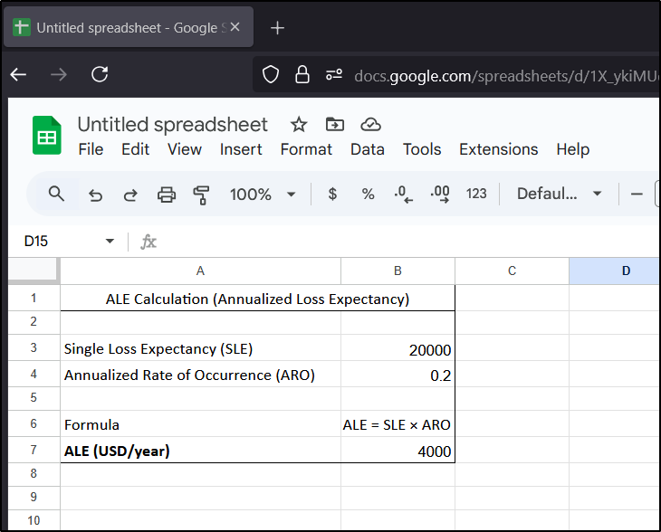

# Task 6

# 6. Risk Assessment Practice

### Mock Scenario:

Single Loss Expectancy (SLE) = 20000

Annualized Rate of Occurrence (ARO) = 0.2

### Task:

- Calculate ALE for a ransomware scenario (SLE = $10,000, ARO = 0.2) in Google Sheets. Document: ALE = SLE × ARO.

### Risk Matrix:

| Risk Matrix (Likelihood × Impact) | Insigficant -
1 | Minor -
2 | Significant -
3 | Major -
4 | Severe -
5 |
| --- | --- | --- | --- | --- | --- |
| Almost Certain - 5 | 5 | 10 | 15 | 20 | 25 |
| Likely - 4 | 4 | 8 | 12 | 16 | 20 |
| Moderate - 3 | 3 | 6 | 9 | 12 | 15 |
| Unlikely - 2 | 2 | 4 | 6 | 8 | 10 |
| Rare - 1 | 1 | 2 | 3 | 4 | 5 |

### Ransomeware Scenario:

We have got ALE = 2000 dollar.