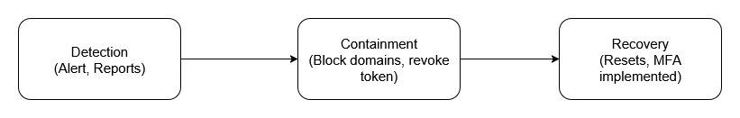

# Task 7

# 7. Create an Incident Response Report

**Classification:** Internal / Confidential

**Incident ID:** PH-001

**Date:** 22 Aug 2025 (IST)

**Prepared by:** Security Operations

**Version:** 1.0

---

## 1) Executive Summary

On 18–19 Aug 2025, a simulated phishing campaign was conducted against corporate mailboxes to assess detection, response, and user awareness. The exercise deliberately mimicked a credential-harvesting attempt themed as an “O365 MFA reset notice.” 9 of 100 targeted users clicked the link; 2 submitted credentials to a spoofed portal. No production systems were compromised. MFA and conditional access policies prevented unauthorized sign-ins; EDR and mail gateway controls performed as intended. The incident response (IR) process successfully detected the activity within 11 minutes, contained exposure by blocking the domain and quarantining messages within 38 minutes, and completed recovery actions (password resets, mail search & purge, and awareness comms) within 6 hours.

**Business Impact (Simulated):** Minimal operational impact; reputational risk mitigated by rapid response and user communications.

**Root Cause (Learning):** Users’ susceptibility to credential phishing and lack of scrutiny for look‑alike domains.

**Key Outcomes:** Reduced mean time to detect (MTTD) to 11 minutes; mean time to contain (MTTC) 38 minutes; 100% completion of affected users’ password resets and re‑enrollment in MFA.

---

## 2) Incident Overview

**Incident Type:** Phishing (credential harvesting – simulated)

**Severity (Exercise):** SEV‑3 (low operational impact; high training value)

**Status:** Closed (Exercise complete)

**Assets In Scope:** Corporate O365 tenant, email security gateway, SIEM, EDR, IAM/MFA services

**Participants:** Blue Team (SOC/IR), IT Helpdesk, IAM, Communications, Red Team (exercise control)

---

## 3) Detection & Triage

**Initial Detection:** SIEM rule "Multiple clicks to newly observed domain in short window" fired at 10:11 IST on 18 Aug 2025.

**Corroborating Signals:**

- Mail gateway URL‑rewrite logs showing redirects to a newly registered domain.
- Identity protection alerts for atypical authentication attempts (denied by MFA).
- User report via phishing button (PhishAlert) at 10:19 IST.

**Preliminary Assessment:** Campaign is targeted yet broad; payload is a spoofed O365 login page (no malware). Risk focused on credential exposure.

---

## 4) Indicators of Compromise (Exercise IOCs)

- **Sender display name:** “IT Support” (spoofed)
- **From:** notifications@o365-updates[.]support (look‑alike domain)
- **Subject:** “Action Required: MFA Reset Notice”
- **URL:** https://o365-updates.support/verify
- **Landing page:** Fake O365 portal hosting form capture
- **Hosting IP (simulated):** 198.51.100.45
- **User‑agent patterns:** Common desktop browsers; no malware executables observed

---

## 5) Timeline (IST)

| Time & Date | Event |
| --- | --- |
| 18 Aug 2025 10:00 | Phishing emails delivered to 100 users (simulation start) |
| 18 Aug 2025 10:11 | SIEM alert: spike in clicks to new domain |
| 18 Aug 2025 10:26 | IR activated; incident commander assigned |
| 18 Aug 2025 10:38 | Containment: domain blocked; messages quarantined |
| 18 Aug 2025 11:05 | Forced password resets & token revocation for impacted users |
| 18 Aug 2025 12:40 | User communications sent; status “contained” |

---

## 6) Impact Assessment

- **Users who clicked:** 9/100 (9%)
- **Credentials submitted:** 2 users (2%)
- **Unauthorized sign‑ins:** 0 (MFA blocked)
- **Data exfiltration:** None observed
- **Operational downtime:** None

---

## 7) Containment

**Immediate Controls:**

1. Block look‑alike domain at mail gateway, DNS, and proxy.
2. Quarantine all campaign messages; retract from inboxes.
3. Disable passwordless tokens for affected identities and require re‑auth.

**Isolation Measures:**

- Monitor for any device beaconing to the domain/IP (none observed).
- Watchlist impacted accounts for 7 days (SIEM rule with high‑fidelity threshold).

---

## 8) Eradication

1. Force password resets for impacted users; invalidate all refresh tokens and revoke OAuth sessions.
2. Review OAuth app consents; remove any suspicious grants (none found).
3. Update URL and domain blocklists across security layers.

---

## 9) Recovery

1. Re‑enroll impacted users into MFA (phishing‑resistant methods preferred, e.g., FIDO2).
2. Restore normal mail flow after verifying no residual messages.
3. Confirm SIEM visibility and alert tuning; return to BAU monitoring.

---

## 10) Communications

- **User Advisory (18 Aug 12:40):** What happened, how to verify account security, do’s/don’ts.
- **IT/Helpdesk Brief:** Scripts for password reset support, common Q&A.
- **Leadership Update:** Executive summary, metrics (click‑rate, MTTD/MTTC), and mitigations.

---

## 11) Mitigation Steps (Forward‑Looking)

**People**

- Targeted refresher training for the 9 clickers within 7 days (IST).
- Quarterly phishing simulations with progressive difficulty; aim <5% click‑rate by Q4 2025.

**Process**

- Codify IR runbook for credential‑phish, including 30‑minute containment SLA.
- Establish comms templates for rapid user and leadership notifications.

**Technology**

- Enforce phishing‑resistant MFA for all employees and privileged roles.
- Deploy domain‑similarity detection in the mail gateway (Levenshtein threshold).
- Enable Conditional Access “impossible travel” + token‑theft detection.
- Auto‑purge via API when a campaign pattern is confirmed (SOAR playbook).

## Flow Chart

